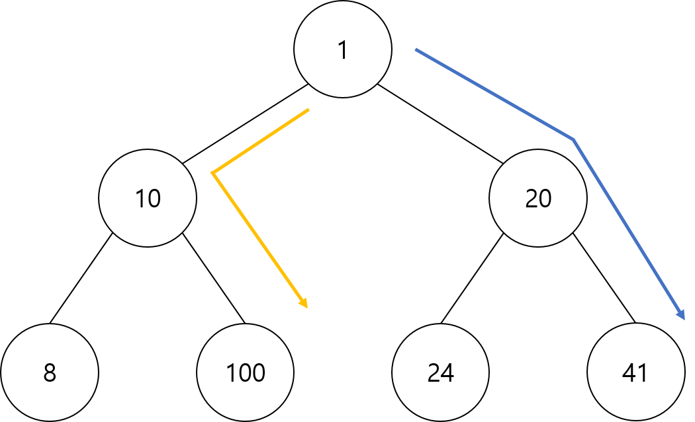

# 그리디 알고리즘

## 그리디 알고리즘이란?

탐욕(그리디) 알고리즘이란 현재 상황에서 가장 최선의(좋은) 선택을 고르는 알고리즘을 의미한다. 
그리디 알고리즘은 현재 상황의 가장 좋은 결과를 선택하는 것으로 최종 결과에 대한 최적의 해를 구하는 것과는 다르다. 

 
위와 같은 예시에서 가장 합이 큰 경로를 찾는다고 할 때 
최종적으로 가장 최적의 해는 노란색 루트를 따라 111을 구하는 경로이다. 
그러나 그리디 알고리즘은 루트에서 가장 최적의 해인 20으로, 20에서 가장 최적의 해인 41로 가는 파란색 루트를 따라간다. 현재의 상황에서 가장 큰 수를 따라 최종적으로 62의 값을 얻게된다. 
이렇게 그리디알고리즘이 최종적으로 가장 최적의 해를 구하는 것은 아니다.

## 그리디 알고리즘의 조건

그렇다면 그리디 알고리즘을 사용할 수 있는 상황의 조건은 어떻게 될까? 

- 탐욕 선택 속성 : 앞의 선택이 이후의 선택에 영향을 주지 않는다.
- 최적 부분 구조 : 작은 부분 문제의 답을 합쳐 전체 문제의 최적의 답을 구할 수 있다.

위와 같은 특성을 가지는 문제들을 해결하는 강점이 있다. 
